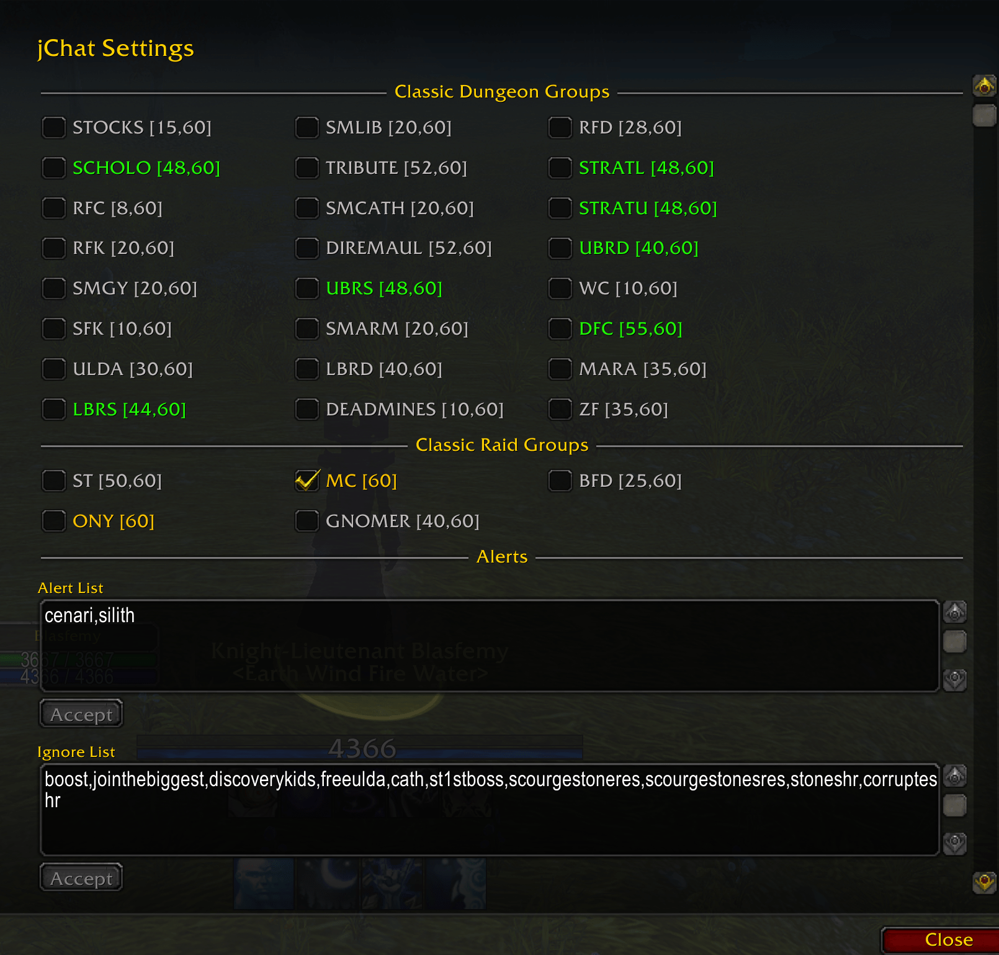
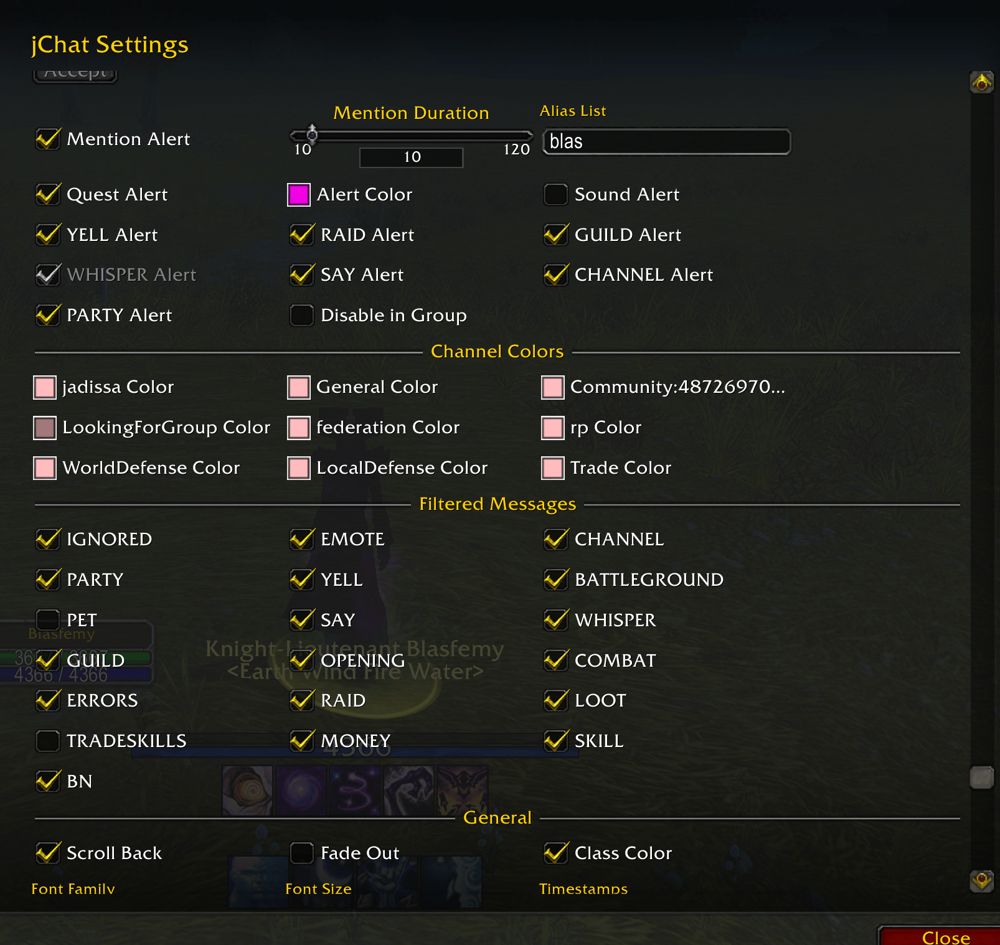
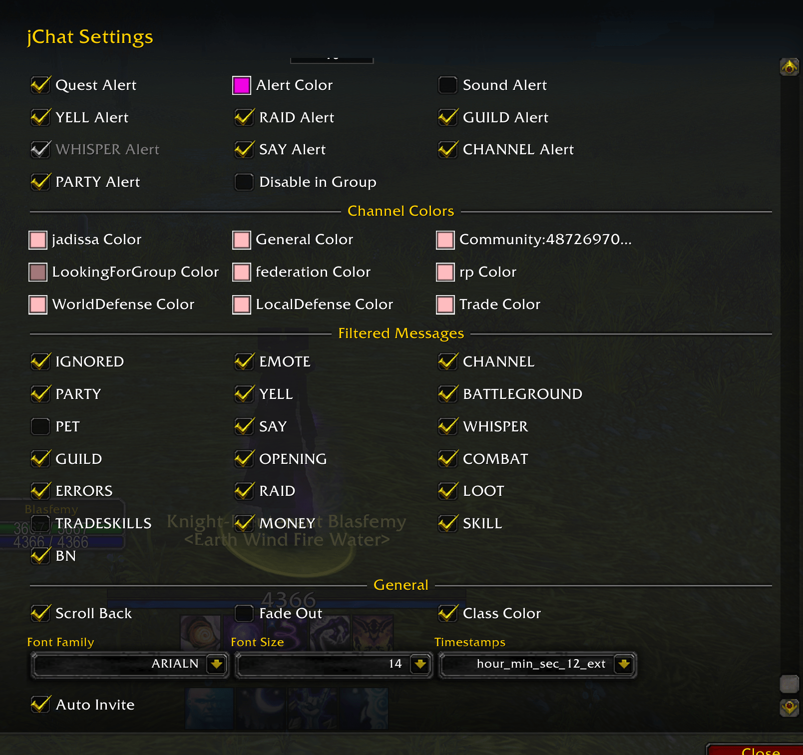

# jChatFilter
## Warcraft chat mod, since 2019

## License

## Why
- Because relevant chat alerts bring chat to a whole new level 
- ...reading chat is time-consuming
- ..there is a lot of spam

## How
Interface > Addons UI

## Platforms
UI works with Classic Era, Classic Wrath and Retail

## Issues
https://github.com/jadissa/jChatFilter/issues

## Screenshots

  

  

  

